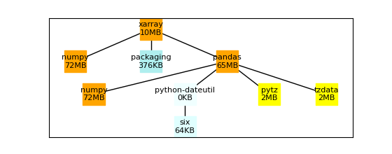
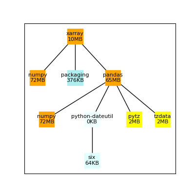

# PyDepGraph

PyDepGraph is a Python package for creating dependency graphs from Python packages.

## Installation

You can install PyDepGraph using pip:

```bash
pip install pydepgraph
```

## Usage

PyDepGraph is intended for use from the command line and can be called using
`pydepgraph`.

```
> pydepgraph cartopy cartopy_depgraph.png -h
usage: pydepgraph [-h] [-c DEPS_CACHE_FILE] [--refresh] [--no-cache] [-f FIGSIZE FIGSIZE] package output_file

Create a dependency graph of a Python package.

positional arguments:
  package               The name of the package to create the dependency graph for.
  output_file           The name of the file to save the dependency graph to.

options:
  -h, --help            show this help message and exit
  -c CACHE_FILE, --cache-file CACHE_FILE
                        The name of the file to cache the dependencies to. All previous
                        dependency trees will be cached to this file and reused when the
                        same package is requested again. Defaults to 'deps_cache.json'.
  --refresh             Recompute the package's dependencies and replace in the cache file.
  --no-cache            Do not use the cache file for dependencies.
  -f FIGSIZE FIGSIZE, --figsize FIGSIZE FIGSIZE
                        Explicitly set the dimensions (width and height) of the graph in
                        inches. If not provided, a reasonable figsize will be calculated
                        based on the number of nodes in the graph.
```

## Results

Calling PyDepGraph on the xarray package results in the following graph.

```
pydepgraph xarray xarray_depgraph.png
```



By default pydepgraph attempts to produce reasonable figure dimensions based on the
number of graph nodes. However, the formula used may not work well for some packages'
graphs. To manually adjust the shape of the figure, supply the `-f/--figsize` option.

```
pydepgraph xarray xarray_depgraph.png -f 4 4
```



## Caching

By default, pydepgraph caches all previous depenency trees to `./deps_cache.json`. This
allows quickly adjusting graphs without recomputing the dependency tree. The user can
modify the caching behavior using the following options:

- `-c/--cache-file`: Specify a non-default cach file.
- `--refresh`: Recompute the package's depdendencies and replace in the cache file.
- `--no-cache`: Disable the cache for the current call.

## Customizing

Work in progress. Customization options to come later. Thoughts:
- Different label content.
- Allow cumulative size.
- Different color schemes.
  - Different colors.
  - Same color for same package (when repeated packages exist)
- Different graph functions.
- Change node shape.
- Allow multiple connections to a single node.
- etc.